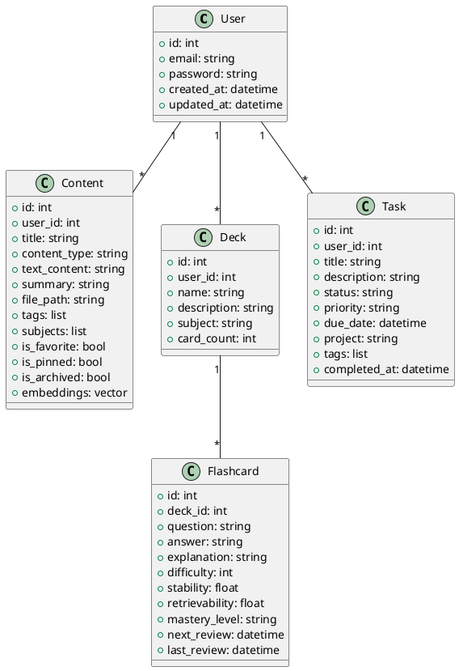
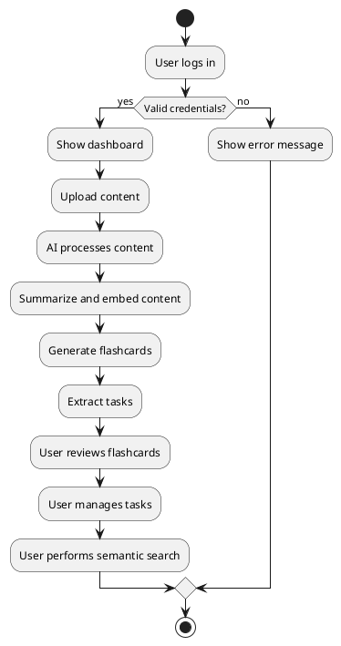
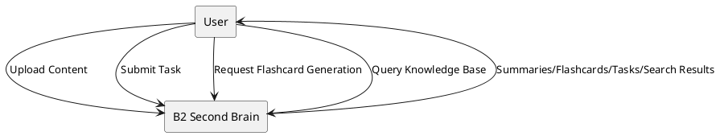
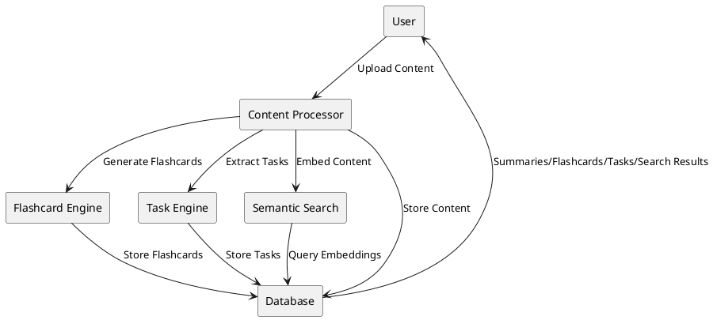
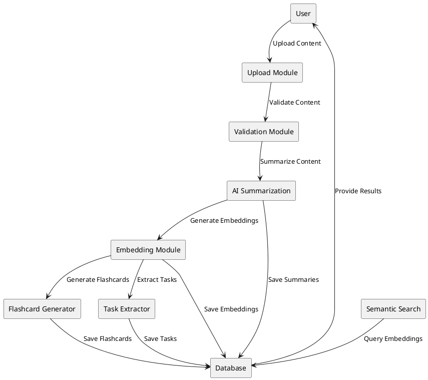

# B2 Second Brain Diagrams

## Class Diagram



## Use Case Diagram

```plantuml
@startuml
actor "User" as User

User --> (Register/Login)
User --> (Upload Content)
User --> (Organize Content)
User --> (AI Summarization)
User --> (Generate Flashcards)
User --> (Review Flashcards)
User --> (Extract Tasks)
User --> (Manage Tasks)
User --> (Semantic Search)
User --> (Text-to-Speech)
User --> (Speech-to-Text)
User --> (View Dashboard)
User --> (Update Profile)
User --> (Pin/Archive Content)
User --> (Favorite Content)
User --> (Tag Content)
User --> (Study Flashcards)
User --> (Submit Task Review)
@enduml
```



## Activity Diagram



## DFD Level 0



## DFD Level 1



## DFD Level 2



## Conclusion

The diagrams presented in this section provide a comprehensive visual representation of the B2 Second Brain system. The class diagram outlines the core data structures and their relationships, while the use case and activity diagrams illustrate user interactions and system workflows. The DFDs (Levels 0, 1, and 2) break down the flow of data and processing within the platform, from high-level user actions to detailed internal modules. Together, these diagrams clarify the architecture, functionality, and data management strategies of B2 Second Brain, serving as valuable references for both development and documentation.
```
